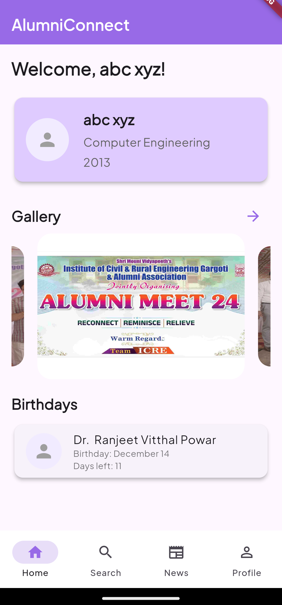

AlumniConnect is a dedicated platform designed to serve the alumni of the Institute of Civil and Rural Engineering.

|  |  |  |
|-----------------------------------------|-----------------------------------------|-----------------------------------------|
| Home Page                               | Settings Page                           | Profile Page                            |
|  |  |  |
| Map View                                | Alerts Page                             | Feedback Page                           |

AlumniConnect offers a centralized space for alumni to stay connected.

Modules:
1) User Management
2) Search/Filter Alumni
3) News

Tech Stack : Flutter, Firebase
