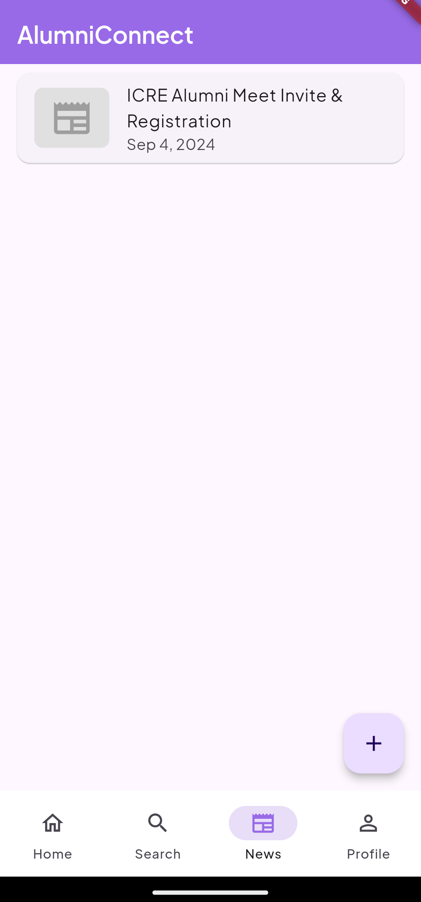

# AlumniConnect

**AlumniConnect** is a dedicated platform designed to serve the alumni of the **Institute of Civil and Rural Engineering**. The platform offers a centralized space for alumni to stay connected, share updates, and maintain professional networks.

---

## Features

### Modules

1. **User Management**
   - Secure authentication and user registration.
   - Profile creation and management.

2. **Search & Filter Alumni**
   - Search for alumni based on name.
   - Advanced filtering options for targeted results.

3. **News**
   - Stay updated with the latest news and announcements from the institute and alumni network.

---

## Screenshots

|  |  |  |
|-----------------------------------------|-----------------------------------------|-----------------------------------------|
| **Home Page**                           | **Search Page**                         | **Filter Alumni**                        |

|  |  |  |
|------------------------------------------|------------------------------------------|------------------------------------------|
| **Profile Page**                         | **Privacy/Visibility Settings**          | **News Page**                            |

---

## Tech Stack

- **Frontend**: Flutter
- **Backend**: Firebase
  - Firebase Authentication
  - Firestore Database

---

## Getting Started

### Prerequisites

- Install Flutter SDK: [Flutter Installation Guide](https://flutter.dev/docs/get-started/install)
- Set up Firebase: [Firebase Setup Guide](https://firebase.google.com/docs/flutter/setup)

### Setup Instructions

1. **Clone the repository:**

   ```bash
   git clone [https://github.com/Rajvardhan-Desai/AlumniConnect]

2. Navigate to the project directory:

```bash
   cd AlumniConnect

3. Install dependencies:

```bash
   flutter pub get


4. Configure Firebase:

Go to the Firebase Console, create a new Firebase project (if you haven't already), and follow the setup instructions.

For Android, download the google-services.json file and place it in the android/app directory of your project.

For iOS, download the GoogleService-Info.plist file and place it in the ios/Runner directory of your project.


5. Run the application:

Finally, run the application on an emulator or a connected device by executing:

flutter run


---
