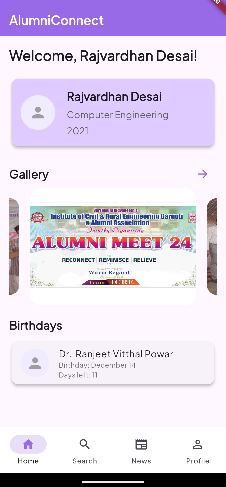
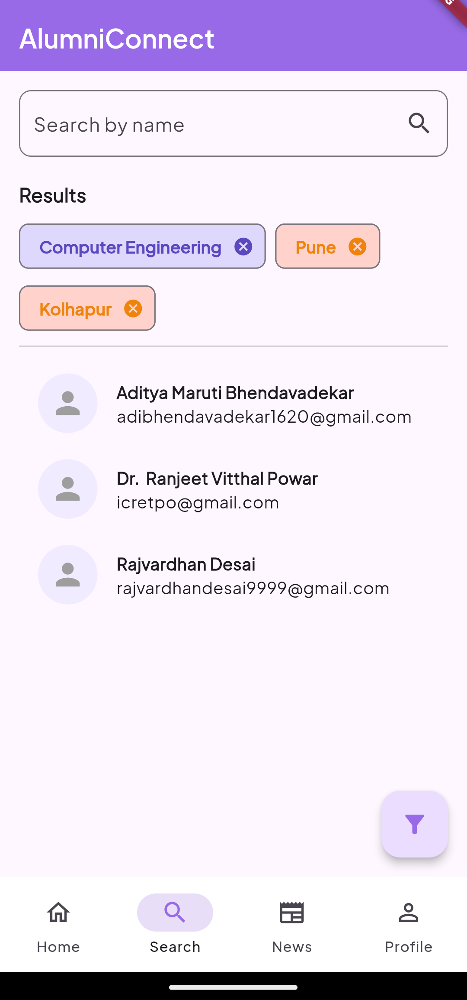
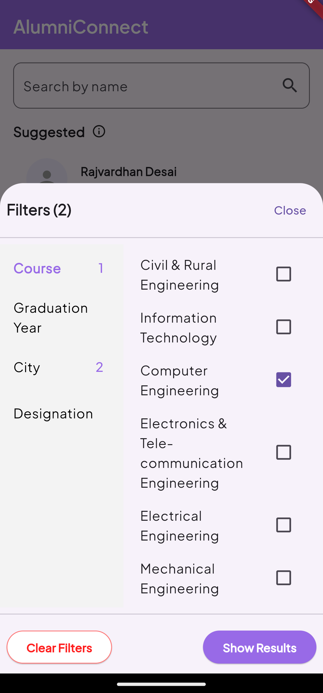
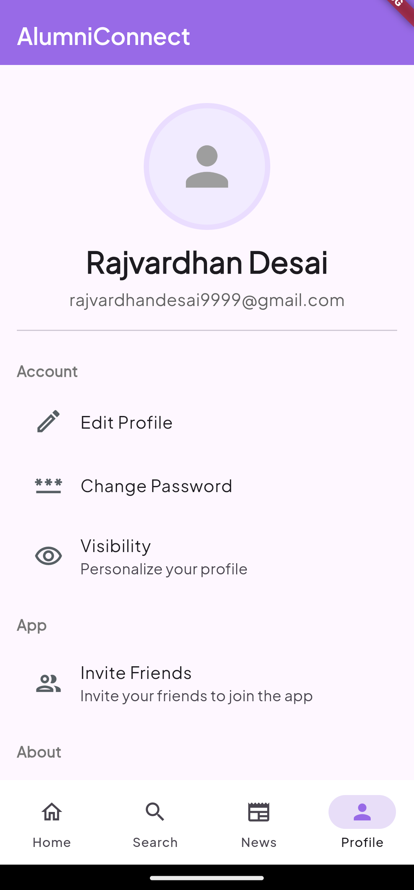
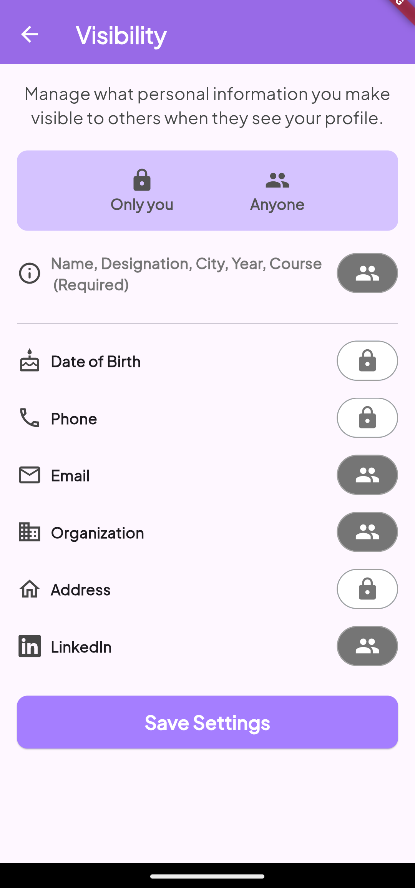

# AlumniConnect

**AlumniConnect** is a dedicated platform designed to serve the alumni of the **Institute of Civil and Rural Engineering**. The platform offers a centralized space for alumni to stay connected, share updates, and maintain professional networks.

---

## Features

### Modules

1. **User Management**
   - Secure authentication and user registration.
   - Profile creation and management.

2. **Search & Filter Alumni**
   - Search for alumni based on name, batch, or specialization.
   - Advanced filtering options for targeted results.

3. **News**
   - Stay updated with the latest news and announcements from the institute and alumni network.

---

## Screenshots

|  |  |  |
|-----------------------------------------|-----------------------------------------|-----------------------------------------|
| **Home Page**                           | **Search Page**                         | **Filter Alumni**                        |

|  |  |  |
|------------------------------------------|------------------------------------------|------------------------------------------|
| **Profile Page**                         | **Privacy/Visibility Settings**          | **News Page**                            |

---

## Tech Stack

- **Frontend**: Flutter
- **Backend**: Firebase
  - Firebase Authentication
  - Firestore Database

---

## Getting Started

### Prerequisites

- Install Flutter SDK: [Flutter Installation Guide](https://flutter.dev/docs/get-started/install)
- Set up Firebase: [Firebase Setup Guide](https://firebase.google.com/docs/flutter/setup)

### Setup Instructions

1. **Clone the repository:**

   ```bash
   git clone https://github.com/your-username/alumniconnect.git
